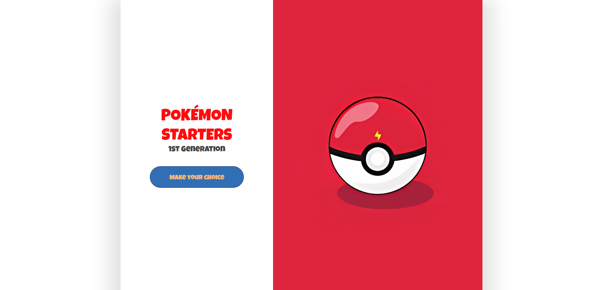
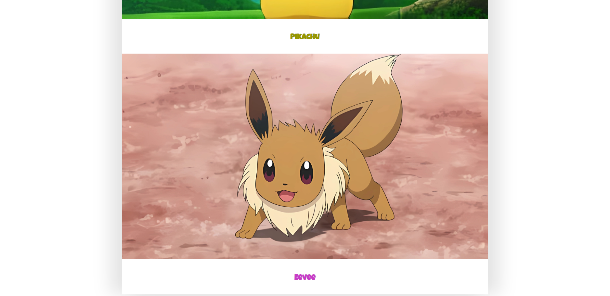

# Project-MyFirstWeb

Project Description: 
Replicate the website provided as reference in "Initial Exercise".
Replicar la web provista en link de "Initial Exercise".

## Links
<a href="https://www.figma.com/design/k0oKkqokLqqvW1Mp9wnDGa/sketch-%26-mockup?node-id=0-1&t=oNpHNlmfCIEjNd9P-0">Figma link - Our Sketch and Mockup</a>
 
<a href="https://pablosja.github.io/Project-MyFirstWeb/">Deploy</a>

## Screenshots:

## Collaborators: 
<a href="https://github.com/pablosja">Pablo San José.</a>
 
<a href="https://github.com/devjmv">Javier Martínez</a>
